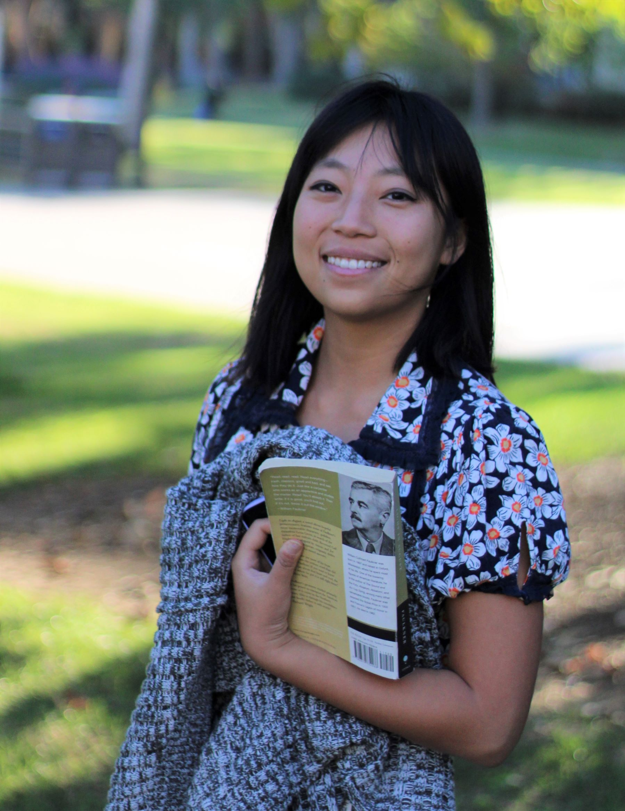

---
layout: post
title: ""
--

I am a third-year PhD student at the UCSD, studying Experimental Psychology with a specialization in decision making and social cognition. I am passionate about understanding human cognition, and I am experienced in human-subject experimental design, quantitative and qualitative analysis, and interdisciplinary research. I am ready to translate my research to real-life questions.

